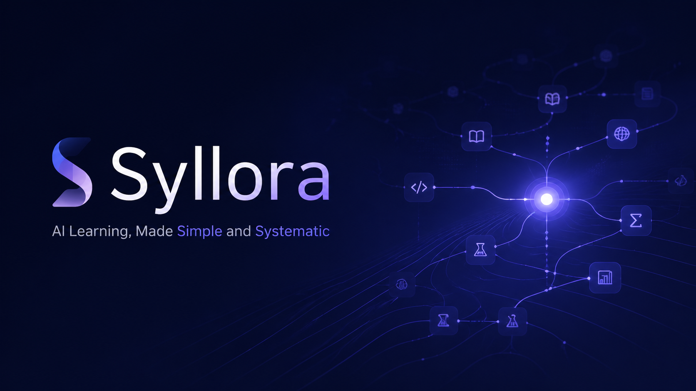

# Syllora



[中文](#中文说明) | [English](#english)

---

## Experience Deployment / 体验版部署

- 中文部署说明：[`docs/deployment-experience.md`](docs/deployment-experience.md)
- Recommended quickest path: **Railway 单服务部署 + Volume 挂载**

---

## 中文说明

### 项目简介

**Syllora** 是一个面向 AI 时代的辅助学习系统。

它的核心目标是：

> 让学习变得更简单、更系统，并把进入一个复杂领域的成本压到足够低。

用户只需要输入“想学什么”，Syllora 就会自动完成：

1. 主题分析与研究资料整理
2. 联网检索与结构化研究文档生成
3. 阶段化学习路径规划
4. 每个阶段的详细知识讲解生成
5. 每个阶段的多图讲解生成
6. 结果以稳定可解析的 Markdown / JSON / 图片资产形式落盘

它不是普通聊天工具，也不是传统课程库，而是一个 **AI Learning Workspace / 学习路径生成系统**。

---

### 当前版本亮点（v0.1.0）

- **对话式主题输入**：从首页直接输入学习目标
- **真实 API 接入**：支持真实文本模型与图片模型配置
- **结构化研究生成**：自动生成研究文档、来源列表、解析结果
- **阶段式学习路径**：将学习主题拆成多个可浏览阶段
- **阶段详情生成**：点击阶段即可生成细粒度知识讲解
- **多图生成**：每个阶段默认生成多张教学图示
- **并发生成**
  - 多个阶段可并发生成
  - 单阶段内部图片也可并发生成
- **流式更新**
  - 显式进度展示
  - 分段流式正文刷新
  - 首页与阶段页统一生成体验
- **公式支持**
  - 行内公式：`$...$`
  - 块级公式：`$$...$$`
  - 前端使用 MathJax 渲染
- **SSE 实时刷新**：通过事件流实时更新项目状态与草稿
- **稳定可解析输出**
  - prompt 收束
  - markdown 解析
  - canonical 结构化落盘

---

### 项目结构

```text
Syllora/
├─ apps/
│  ├─ backend/
│  │  ├─ learningpackage/
│  │  │  ├─ config.py
│  │  │  ├─ llm_client.py
│  │  │  ├─ markdown_tools.py
│  │  │  ├─ project_store.py
│  │  │  └─ server.py
│  │  ├─ main.py
│  │  ├─ pyproject.toml
│  │  └─ uv.lock
│  └─ frontend/
│     ├─ src/
│     ├─ package.json
│     └─ verification/
├─ assets/
│  └─ github-cover/
├─ config/
│  ├─ ai.config.template.toml
│  └─ ai.config.toml        # 本地使用，已被 git ignore
├─ content/
│  └─ library/
├─ data/
│  └─ plans/                # 运行时生成，已被 git ignore
└─ README.md
```

---

### 单个学习主题仓库结构

```text
data/plans/<topic-id>/
├─ project.json
├─ research.md
├─ research.parsed.json
├─ sources.json
├─ learning_plan.md
├─ learning_plan.parsed.json
├─ stage_index.json
├─ meta/
│  ├─ research.generation.json
│  └─ plan.generation.json
└─ stages/
   └─ goal-001/
      ├─ lesson.md
      ├─ lesson.parsed.json
      ├─ stage_detail.json
      ├─ generation.json
      └─ assets/
         ├─ diagram-01.png
         ├─ diagram-02.png
         └─ *.meta.json
```

---

### 技术栈

- **Backend**: Python 3.13, 标准库 HTTP Server, uv
- **Frontend**: React 19, Vite
- **Realtime**: Server-Sent Events (SSE)
- **Math Rendering**: MathJax
- **LLM**
  - 文本模型：OpenAI-compatible Responses / Chat Completions
  - 图片模型：`gpt-image-2`

---

### 启动方式

#### 后端

在 `apps/backend/` 目录执行：

```bash
uv run python main.py serve --host 127.0.0.1 --port 8000
```

健康检查：

```text
http://127.0.0.1:8000/api/health
```

#### 前端

在 `apps/frontend/` 目录执行：

```bash
npm install
npm run dev
```

默认地址：

```text
http://127.0.0.1:5173
```

生产构建：

```bash
npm run build
```

---

### 配置说明

项目优先读取：

1. `config/ai.config.toml`
2. 环境变量
3. 内置默认值

请先复制模板：

```bash
cp config/ai.config.template.toml config/ai.config.toml
```

模板核心结构：

```toml
[text]
model_provider = "OpenAI"
model = "gpt-5.4"
review_model = "gpt-5.4"
model_reasoning_effort = "xhigh"
disable_response_storage = true
network_access = "enabled"
model_context_window = 1000000
model_auto_compact_token_limit = 900000

[text.provider]
name = "OpenAI"
base_url = "https://api.asxs.top/v1"
wire_api = "responses"
requires_openai_auth = true
api_key = "YOUR_OPENAI_API_KEY"

[image]
model_id = "gpt-image-2"

[image.connection]
_type = "newapi_channel_conn"
key = "YOUR_IMAGE_API_KEY"
url = "https://4sapi.com"

[[image.channels]]
_type = "newapi_channel_conn"
key = "YOUR_SECONDARY_IMAGE_API_KEY"
url = "https://xcode.best"
```

> 注意：`config/ai.config.toml` 含真实密钥，不会提交到 GitHub。

---

### 主要接口

- `GET /api/health`
- `GET /api/library`
- `GET /api/library/{libraryId}`
- `GET /api/projects`
- `GET /api/projects/{projectId}`
- `POST /api/projects`
- `POST /api/projects/{projectId}/messages`
- `GET /api/projects/{projectId}/events`
- `POST /api/projects/{projectId}/research`
- `POST /api/projects/{projectId}/plan`
- `POST /api/projects/{projectId}/goals/{goalId}/lesson`
- `POST /api/projects/{projectId}/lessons/batch`
- `GET /api/projects/{projectId}/goals/{goalId}/image`
- `GET /api/projects/{projectId}/goals/{goalId}/images/{index}`

---

### 生成流程

1. 用户输入学习主题
2. 系统创建项目与上下文
3. 后端生成研究文档
4. 后端拆出阶段化学习路径
5. 用户可单独生成某阶段，或并发生成全部阶段
6. 每个阶段先流式生成正文，再并发生成多张图示
7. 前端通过 SSE 实时刷新进度、草稿、阶段状态
8. 最终结果写入本地主题仓库

---

### 输出稳定性设计

为了让前端展示和后续二次处理更稳定，Syllora 采用：

- prompt 收束
- markdown 结构约束
- 生成后解析
- canonical 结构重建
- 文件化落盘

核心原则：

> generate → parse → normalize → persist

---

### 版本记录

详见：[CHANGELOG.md](./CHANGELOG.md)

---

## English

### Overview

**Syllora** is an AI-assisted learning system designed to make learning simpler, more systematic, and much cheaper to start.

Users enter a topic, and Syllora automatically:

1. analyzes the topic,
2. gathers and organizes research materials,
3. creates a staged learning path,
4. generates detailed lesson content for each stage,
5. generates multiple instructional images per stage,
6. persists everything as machine-parseable Markdown / JSON / image assets.

Syllora is not just a chatbot and not just a content library.
It is an **AI Learning Workspace** for structured entry into complex topics.

---

### Highlights in v0.1.0

- conversational topic input
- real text-model and image-model integration
- structured research generation
- staged learning-path planning
- on-demand lesson generation
- multi-image stage generation
- parallel stage generation
- parallel image generation inside each stage
- streaming progress and partial-content refresh
- formula support with MathJax
- SSE-based real-time UI updates
- stable parseable output pipeline

---

### Tech Stack

- **Backend**: Python 3.13, standard-library HTTP server, uv
- **Frontend**: React 19, Vite
- **Realtime**: Server-Sent Events (SSE)
- **Math Rendering**: MathJax
- **LLM**:
  - OpenAI-compatible text gateway
  - `gpt-image-2` image generation

---

### Quick Start

#### Backend

From `apps/backend/`:

```bash
uv run python main.py serve --host 127.0.0.1 --port 8000
```

Health endpoint:

```text
http://127.0.0.1:8000/api/health
```

#### Frontend

From `apps/frontend/`:

```bash
npm install
npm run dev
```

Dev URL:

```text
http://127.0.0.1:5173
```

Production build:

```bash
npm run build
```

---

### Configuration

Runtime configuration is loaded in this order:

1. `config/ai.config.toml`
2. environment variables
3. built-in defaults

Use `config/ai.config.template.toml` as your starting point.

---

### Main API Endpoints

- `GET /api/health`
- `GET /api/library`
- `GET /api/projects`
- `GET /api/projects/{projectId}`
- `POST /api/projects`
- `POST /api/projects/{projectId}/messages`
- `GET /api/projects/{projectId}/events`
- `POST /api/projects/{projectId}/research`
- `POST /api/projects/{projectId}/plan`
- `POST /api/projects/{projectId}/goals/{goalId}/lesson`
- `POST /api/projects/{projectId}/lessons/batch`
- `GET /api/projects/{projectId}/goals/{goalId}/image`
- `GET /api/projects/{projectId}/goals/{goalId}/images/{index}`

---

### Stability Strategy

To keep outputs reliable for UI rendering and downstream processing, Syllora uses:

- constrained prompts
- markdown structure rules
- post-generation parsing
- canonical normalization
- file-based persistence

Core principle:

> generate → parse → normalize → persist
